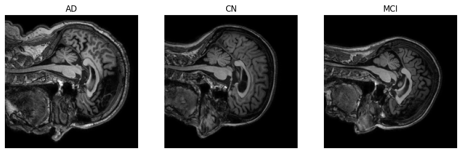
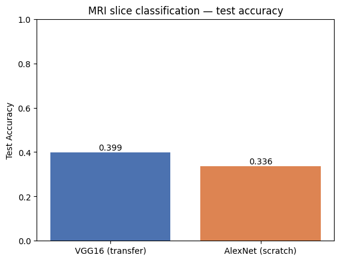
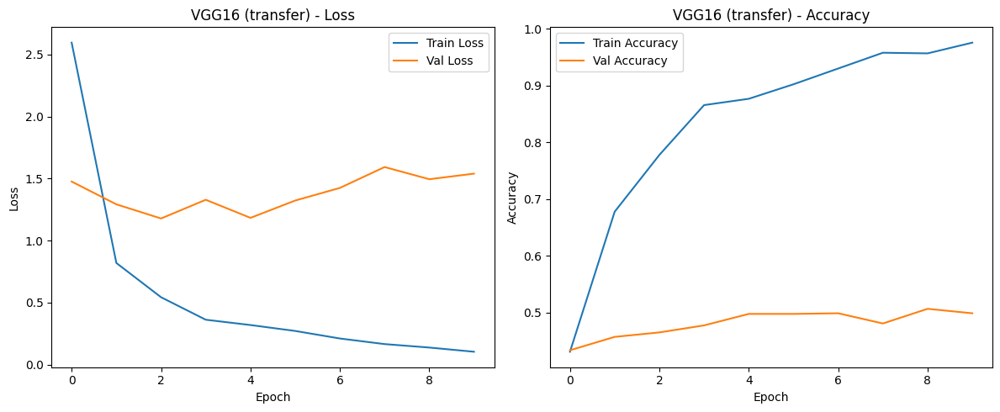
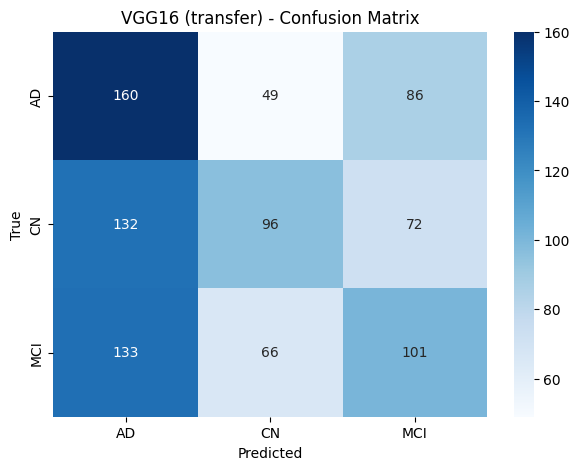
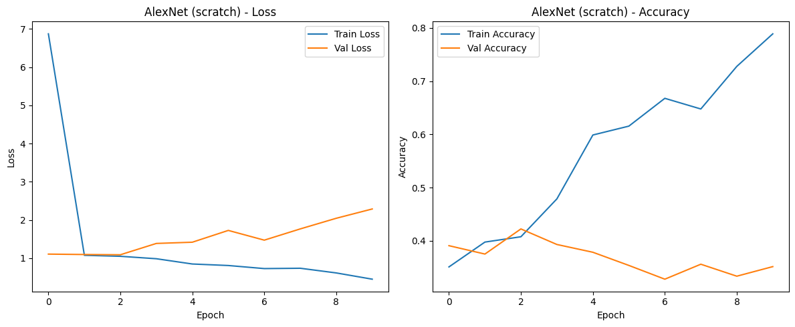
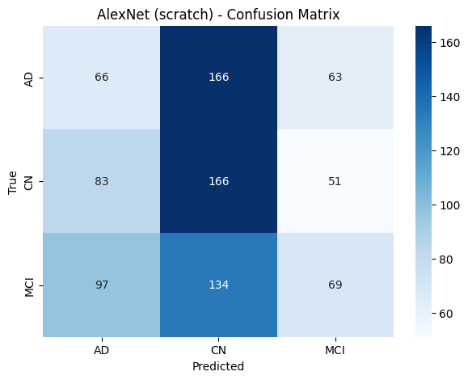

# Transfer Learning on MRI Slices — AlexNet & VGG16

Earlier in this repo, transfer learning was only explored on **CIFAR-10**. This notebook brings
that idea to the **ADNI Alzheimer's MRI** data, classifying scans into **AD / CN / MCI**.

## Approach

The 3D-CNN experiments used full volumes. ImageNet-pretrained CNNs are 2D, so here each `.nii`
volume is reduced to a few **central axial slices**, converted to 3-channel `224×224` images, and
fed to two models:

| Model    | Type | Notes |
| :------- | :--- | :---- |
| **VGG16**   | True transfer learning | Frozen ImageNet base + new classification head. |
| **AlexNet** | Trained from scratch | Keras has **no** pretrained AlexNet, so it's the from-scratch baseline (same as the CIFAR notebook). |

## Data

Same as the 3D-CNN notebook — ADNI MRI (Kaggle), NIfTI `.nii`, layout:

```
train/train/{AD, CN, MCI}
val/val/{AD, CN, MCI}
test/test/{AD, CN, MCI}
```

## Pipeline

1. Load each volume with `nibabel`, take `SLICES_PER_VOLUME` central axial slices.
2. Per-slice min-max scale to `0–255`, stack to 3 channels, resize to `224×224`.
3. VGG16 path uses `vgg16.preprocess_input`; AlexNet path scales to `[0, 1]`.
4. Train, then evaluate with shared `plot_history` / `evaluate_predictions` helpers
   (confusion matrix, classification report, OvR ROC-AUC) for comparison with the CIFAR results.

Example axial slices, one per class:



## Results

Run with `MAX_SCANS_PER_CLASS=60`, `SLICES_PER_VOLUME=5` (895 test slices). Chance level for 3
classes is ≈ 0.33.

| Model | Test Accuracy | Macro F1 | ROC-AUC (OvR) |
| :--- | :---: | :---: | :---: |
| VGG16 (transfer) | 0.399 | 0.39 | 0.568 |
| AlexNet (scratch) | 0.336 | 0.32 | 0.519 |



**VGG16 (transfer) — training curves and confusion matrix**




**AlexNet (scratch) — training curves and confusion matrix**




### Observations

- Both models land close to chance (0.33) — consistent with the 3D-CNN experiments in this repo,
  where the small data subset and the difficulty of AD/CN/MCI from single slices limit performance.
- Pretrained VGG16 edges out the from-scratch AlexNet, but neither separates the classes well
  (ROC-AUC barely above 0.5).
- Likely paths to improvement: use more scans, sample more (and better-localised) slices, add
  augmentation, and balance/aggregate slice predictions back to the scan level.

## Tech Stack

Python · TensorFlow / Keras · PyTorch (resize) · Nibabel · NumPy · Matplotlib · scikit-learn · seaborn
